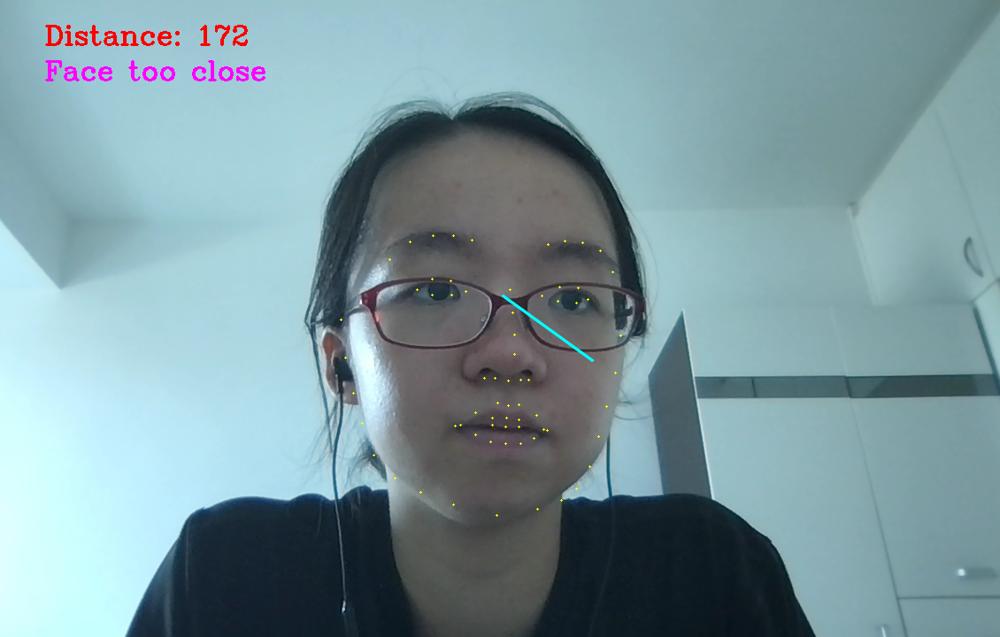

# Online Class Monitor Model
## What is it?
This is an AI model using AI learning to compute the distance between the user's face and the computer screen, which is then used to give the user feedback based on the threshold distance that the user can calibrate at the beginning.

Figure 1 - face is too close to screen


Figure 2 - face is at appropriate distance from screen


## How to install
1. We highly recommend using the anaconda virtual environment.
```sh
conda env create -f aifeedback.yaml
```
- (Optional) If you want to make your own anaconda environment from scratch, create one with python version 3.8 as below, and refer to requirements.txt to find the packages needed:
```sh
conda create -n aifeedback python=3.8
```

2. Build grpc protobuf.
```sh
bash build_grpc_pb.sh
```
3. Build FaceBoxes.
```sh
cd FaceBoxes
bash build_cpu_nms.sh
cd ..
```
## How to run
1. Run server.py.
```python
python3 server.py
```
2. On a separate terminal window, run client.py.
```python
python3 client.py
```
